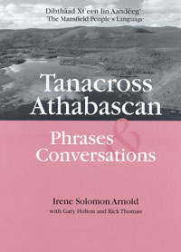

# Credits

Solomon, Irene & Holton, Gary & Thoman, Richard. 2003. Dihthâad Xt’een Iin Aanděg’, The Mansfield People’s Language (Tanacross Phrase and Conversation Lessons). Fairbanks: Alaska Native Language Center.
