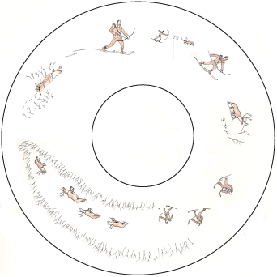

This site is intended to provide some examples of basic vocabulary and phrases in Tanacross, with accompanying audio recordings. The material represented here is based on the speech of particular Tanacross speakers. Some speakers may have different pronunciations or even entirely different ways of saying some of the phrases in this booklet. That is to be expected. (Consider the amount of variation in pronunciation among speakers of English.) One should try using these phrases with other speakers in order to gain a fuller appreciation of the language. 

{: .text-center }
Click on any category to get started, or just begin with:

{: .text-center }
[Common Expressions](){: .btn .btn-green  }

The materials on this site were originally produced as part of the *Tanacross Phrase and Conversation Lessons*, published in 2003 as a booklet with accompanying compact disc. The original book and CD set is available for purchase from the  the [Alaska Native Language Center](https://epay.alaska.edu/C21563_ustores/web/product_detail.jsp?PRODUCTID=5708&SINGLESTORE=true).

